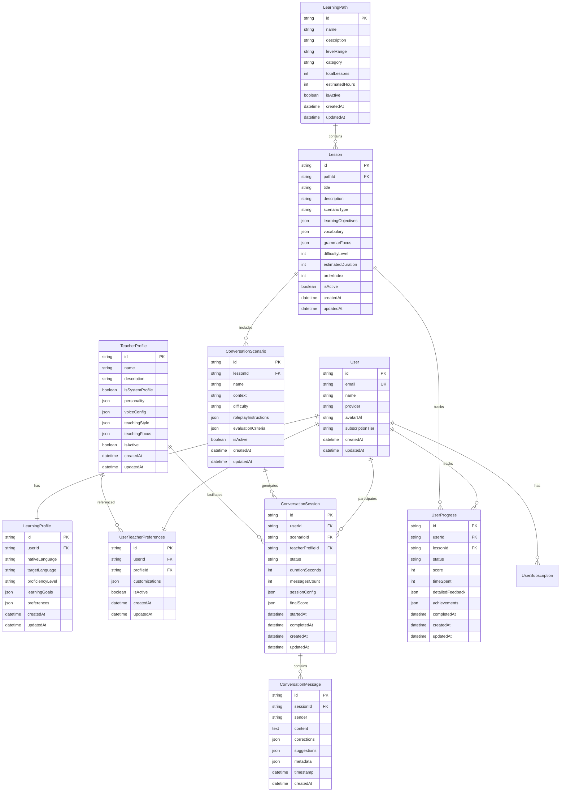

# Database Schema

This document provides comprehensive documentation of the PostgreSQL database schema used in EnglishAI Master, including entity relationships, indexes, and data migration strategies.

## 🗄️ Schema Overview

The database is designed using PostgreSQL 15+ with Prisma ORM for type-safe database operations. The schema follows normalized design principles with strategic denormalization for performance optimization.

### Core Design Principles
- **Relational Integrity**: Proper foreign key relationships with cascade rules
- **Normalization**: Third normal form (3NF) with strategic exceptions
- **Performance**: Strategic indexing for frequently queried fields
- **Scalability**: Partitioning-ready design for large-scale data
- **Audit Trail**: Created/updated timestamps on all entities

## 📊 Entity Relationship Diagram



## 📋 Detailed Schema Documentation

### User Management

#### User Table
Primary user account information with authentication details.

```sql
CREATE TABLE "User" (
    "id" TEXT NOT NULL,
    "email" TEXT NOT NULL,
    "name" TEXT,
    "provider" TEXT NOT NULL DEFAULT 'credentials',
    "providerId" TEXT,
    "avatarUrl" TEXT,
    "subscriptionTier" TEXT NOT NULL DEFAULT 'free',
    "isEmailVerified" BOOLEAN NOT NULL DEFAULT false,
    "lastLoginAt" TIMESTAMP(3),
    "createdAt" TIMESTAMP(3) NOT NULL DEFAULT CURRENT_TIMESTAMP,
    "updatedAt" TIMESTAMP(3) NOT NULL,
    
    CONSTRAINT "User_pkey" PRIMARY KEY ("id")
);

-- Indexes
CREATE UNIQUE INDEX "User_email_key" ON "User"("email");
CREATE INDEX "User_provider_providerId_idx" ON "User"("provider", "providerId");
CREATE INDEX "User_subscriptionTier_idx" ON "User"("subscriptionTier");
CREATE INDEX "User_lastLoginAt_idx" ON "User"("lastLoginAt");
```

**Field Descriptions:**
- `id`: CUID-based unique identifier
- `email`: User's email address (unique)
- `name`: Display name
- `provider`: Authentication provider (credentials, google, microsoft, apple)
- `providerId`: External provider user ID
- `avatarUrl`: Profile picture URL
- `subscriptionTier`: Subscription level (free, premium, enterprise)
- `isEmailVerified`: Email verification status
- `lastLoginAt`: Last successful login timestamp

#### LearningProfile Table
User's learning preferences and progress tracking.

```sql
CREATE TABLE "LearningProfile" (
    "id" TEXT NOT NULL,
    "userId" TEXT NOT NULL,
    "nativeLanguage" TEXT NOT NULL DEFAULT 'es',
    "targetLanguage" TEXT NOT NULL DEFAULT 'en',
    "proficiencyLevel" TEXT NOT NULL DEFAULT 'beginner',
    "learningGoals" JSONB NOT NULL DEFAULT '[]',
    "preferences" JSONB NOT NULL DEFAULT '{}',
    "weeklyGoalHours" INTEGER DEFAULT 5,
    "preferredLessonLength" INTEGER DEFAULT 30,
    "createdAt" TIMESTAMP(3) NOT NULL DEFAULT CURRENT_TIMESTAMP,
    "updatedAt" TIMESTAMP(3) NOT NULL,
    
    CONSTRAINT "LearningProfile_pkey" PRIMARY KEY ("id"),
    CONSTRAINT "LearningProfile_userId_fkey" FOREIGN KEY ("userId") REFERENCES "User"("id") ON DELETE CASCADE ON UPDATE CASCADE
);

-- Indexes
CREATE UNIQUE INDEX "LearningProfile_userId_key" ON "LearningProfile"("userId");
CREATE INDEX "LearningProfile_proficiencyLevel_idx" ON "LearningProfile"("proficiencyLevel");
```

**Proficiency Levels:**
- `beginner` (A1-A2): Basic understanding
- `intermediate` (B1-B2): Conversational ability
- `advanced` (C1-C2): Near-native proficiency

**Learning Goals JSON Structure:**
```json
{
  "goals": [
    "improve_speaking",
    "business_english",
    "academic_writing",
    "daily_conversation",
    "pronunciation",
    "grammar"
  ],
  "priority": "speaking",
  "timeCommitment": "moderate"
}
```

### Learning Content Management

#### LearningPath Table
Structured curriculum organization with categorized content.

```sql
CREATE TABLE "LearningPath" (
    "id" TEXT NOT NULL,
    "name" TEXT NOT NULL,
    "description" TEXT NOT NULL,
    "levelRange" TEXT NOT NULL,
    "category" TEXT NOT NULL,
    "totalLessons" INTEGER NOT NULL DEFAULT 0,
    "estimatedHours" INTEGER NOT NULL DEFAULT 0,
    "difficulty" INTEGER NOT NULL DEFAULT 1,
    "prerequisites" JSONB DEFAULT '[]',
    "skills" JSONB DEFAULT '[]',
    "isActive" BOOLEAN NOT NULL DEFAULT true,
    "createdAt" TIMESTAMP(3) NOT NULL DEFAULT CURRENT_TIMESTAMP,
    "updatedAt" TIMESTAMP(3) NOT NULL,
    
    CONSTRAINT "LearningPath_pkey" PRIMARY KEY ("id")
);

-- Indexes
CREATE INDEX "LearningPath_category_levelRange_idx" ON "LearningPath"("category", "levelRange");
CREATE INDEX "LearningPath_isActive_idx" ON "LearningPath"("isActive");
CREATE INDEX "LearningPath_difficulty_idx" ON "LearningPath"("difficulty");
```

**Categories:**
- `business`: Professional communication
- `academic`: Educational contexts
- `daily`: Everyday conversations
- `travel`: Tourism and travel scenarios
- `exam_prep`: Test preparation (IELTS, TOEFL, etc.)

#### Lesson Table
Individual learning units with structured content.

```sql
CREATE TABLE "Lesson" (
    "id" TEXT NOT NULL,
    "pathId" TEXT NOT NULL,
    "title" TEXT NOT NULL,
    "description" TEXT NOT NULL,
    "scenarioType" TEXT NOT NULL,
    "learningObjectives" JSONB NOT NULL DEFAULT '[]',
    "vocabulary" JSONB NOT NULL DEFAULT '{}',
    "grammarFocus" TEXT[] DEFAULT ARRAY[]::TEXT[],
    "difficultyLevel" INTEGER NOT NULL DEFAULT 1,
    "estimatedDuration" INTEGER NOT NULL DEFAULT 30,
    "orderIndex" INTEGER NOT NULL,
    "prerequisites" JSONB DEFAULT '[]',
    "isActive" BOOLEAN NOT NULL DEFAULT true,
    "createdAt" TIMESTAMP(3) NOT NULL DEFAULT CURRENT_TIMESTAMP,
    "updatedAt" TIMESTAMP(3) NOT NULL,
    
    CONSTRAINT "Lesson_pkey" PRIMARY KEY ("id"),
    CONSTRAINT "Lesson_pathId_fkey" FOREIGN KEY ("pathId") REFERENCES "LearningPath"("id") ON DELETE CASCADE ON UPDATE CASCADE
);

-- Indexes
CREATE INDEX "Lesson_pathId_orderIndex_idx" ON "Lesson"("pathId", "orderIndex");
CREATE INDEX "Lesson_scenarioType_idx" ON "Lesson"("scenarioType");
CREATE INDEX "Lesson_difficultyLevel_idx" ON "Lesson"("difficultyLevel");
CREATE UNIQUE INDEX "Lesson_pathId_orderIndex_key" ON "Lesson"("pathId", "orderIndex");
```

**Scenario Types:**
- `interview`: Job interview practice
- `presentation`: Business presentations
- `meeting`: Professional meetings
- `restaurant`: Dining scenarios
- `shopping`: Retail interactions
- `medical`: Healthcare contexts
- `travel`: Airport, hotel, transportation
- `academic`: Classroom discussions

**Vocabulary JSON Structure:**
```json
{
  "qualification": "a skill or ability that makes you suitable for a job",
  "experience": "knowledge or skill gained from doing a job",
  "confident": "feeling sure about your abilities",
  "interview": "a formal meeting where someone asks you questions about a job"
}
```

#### ConversationScenario Table
Specific roleplay scenarios within lessons.

```sql
CREATE TABLE "ConversationScenario" (
    "id" TEXT NOT NULL,
    "lessonId" TEXT NOT NULL,
    "name" TEXT NOT NULL,
    "context" TEXT NOT NULL,
    "difficulty" TEXT NOT NULL DEFAULT 'medium',
    "roleplayInstructions" JSONB NOT NULL DEFAULT '{}',
    "evaluationCriteria" JSONB NOT NULL DEFAULT '{}',
    "expectedDuration" INTEGER DEFAULT 600,
    "isActive" BOOLEAN NOT NULL DEFAULT true,
    "createdAt" TIMESTAMP(3) NOT NULL DEFAULT CURRENT_TIMESTAMP,
    "updatedAt" TIMESTAMP(3) NOT NULL,
    
    CONSTRAINT "ConversationScenario_pkey" PRIMARY KEY ("id"),
    CONSTRAINT "ConversationScenario_lessonId_fkey" FOREIGN KEY ("lessonId") REFERENCES "Lesson"("id") ON DELETE CASCADE ON UPDATE CASCADE
);

-- Indexes
CREATE INDEX "ConversationScenario_lessonId_idx" ON "ConversationScenario"("lessonId");
CREATE INDEX "ConversationScenario_difficulty_idx" ON "ConversationScenario"("difficulty");
```

**Roleplay Instructions JSON:**
```json
{
  "userRole": "job candidate",
  "aiRole": "hiring manager",
  "setting": "corporate office interview room",
  "objectives": [
    "introduce yourself professionally",
    "answer behavioral questions",
    "ask thoughtful questions about the role"
  ],
  "keyPhrases": [
    "I have experience in...",
    "My strength is...",
    "Could you tell me more about..."
  ]
}
```

### AI Teacher System

#### TeacherProfile Table
AI teacher personalities and configurations.

```sql
CREATE TABLE "TeacherProfile" (
    "id" TEXT NOT NULL,
    "name" TEXT NOT NULL,
    "description" TEXT NOT NULL,
    "isSystemProfile" BOOLEAN NOT NULL DEFAULT true,
    "personality" JSONB NOT NULL DEFAULT '{}',
    "voiceConfig" JSONB NOT NULL DEFAULT '{}',
    "teachingStyle" JSONB NOT NULL DEFAULT '{}',
    "teachingFocus" JSONB NOT NULL DEFAULT '{}',
    "availability" JSONB DEFAULT '{}',
    "isActive" BOOLEAN NOT NULL DEFAULT true,
    "createdAt" TIMESTAMP(3) NOT NULL DEFAULT CURRENT_TIMESTAMP,
    "updatedAt" TIMESTAMP(3) NOT NULL,
    
    CONSTRAINT "TeacherProfile_pkey" PRIMARY KEY ("id")
);

-- Indexes
CREATE INDEX "TeacherProfile_isSystemProfile_isActive_idx" ON "TeacherProfile"("isSystemProfile", "isActive");
CREATE INDEX "TeacherProfile_name_idx" ON "TeacherProfile"("name");
```

**Personality JSON Structure:**
```json
{
  "name": "Professor Hamilton",
  "title": "Business English Professor",
  "background": "Oxford-educated with 20+ years experience",
  "specialties": ["Business English", "Academic Writing"],
  "catchPhrases": ["Excellent work!", "Let's refine that further"],
  "motivationalStyle": "encouraging yet demanding excellence",
  "avatarUrl": "/avatars/professor-hamilton.jpg",
  "bannerColor": "#2563eb"
}
```

**Voice Configuration JSON:**
```json
{
  "voice": "onyx",
  "speed": 0.9,
  "pitch": 1.0,
  "accent": "british"
}
```

**Teaching Style JSON:**
```json
{
  "personality": "professional",
  "formality": "formal",
  "correctionStyle": "detailed",
  "encouragementLevel": "moderate",
  "adaptability": 8
}
```

#### UserTeacherPreferences Table
User customizations for teacher profiles.

```sql
CREATE TABLE "UserTeacherPreferences" (
    "id" TEXT NOT NULL,
    "userId" TEXT NOT NULL,
    "profileId" TEXT NOT NULL,
    "customizations" JSONB NOT NULL DEFAULT '{}',
    "isActive" BOOLEAN NOT NULL DEFAULT false,
    "createdAt" TIMESTAMP(3) NOT NULL DEFAULT CURRENT_TIMESTAMP,
    "updatedAt" TIMESTAMP(3) NOT NULL,
    
    CONSTRAINT "UserTeacherPreferences_pkey" PRIMARY KEY ("id"),
    CONSTRAINT "UserTeacherPreferences_userId_fkey" FOREIGN KEY ("userId") REFERENCES "User"("id") ON DELETE CASCADE ON UPDATE CASCADE,
    CONSTRAINT "UserTeacherPreferences_profileId_fkey" FOREIGN KEY ("profileId") REFERENCES "TeacherProfile"("id") ON DELETE CASCADE ON UPDATE CASCADE
);

-- Indexes
CREATE INDEX "UserTeacherPreferences_userId_idx" ON "UserTeacherPreferences"("userId");
CREATE INDEX "UserTeacherPreferences_userId_isActive_idx" ON "UserTeacherPreferences"("userId", "isActive");
CREATE UNIQUE INDEX "UserTeacherPreferences_userId_profileId_key" ON "UserTeacherPreferences"("userId", "profileId");
```

### Conversation System

#### ConversationSession Table
Individual conversation instances with users.

```sql
CREATE TABLE "ConversationSession" (
    "id" TEXT NOT NULL,
    "userId" TEXT NOT NULL,
    "scenarioId" TEXT,
    "teacherProfileId" TEXT NOT NULL,
    "status" TEXT NOT NULL DEFAULT 'active',
    "durationSeconds" INTEGER NOT NULL DEFAULT 0,
    "messagesCount" INTEGER NOT NULL DEFAULT 0,
    "sessionConfig" JSONB DEFAULT '{}',
    "finalScore" JSONB,
    "startedAt" TIMESTAMP(3) NOT NULL DEFAULT CURRENT_TIMESTAMP,
    "completedAt" TIMESTAMP(3),
    "createdAt" TIMESTAMP(3) NOT NULL DEFAULT CURRENT_TIMESTAMP,
    "updatedAt" TIMESTAMP(3) NOT NULL,
    
    CONSTRAINT "ConversationSession_pkey" PRIMARY KEY ("id"),
    CONSTRAINT "ConversationSession_userId_fkey" FOREIGN KEY ("userId") REFERENCES "User"("id") ON DELETE CASCADE ON UPDATE CASCADE,
    CONSTRAINT "ConversationSession_scenarioId_fkey" FOREIGN KEY ("scenarioId") REFERENCES "ConversationScenario"("id") ON DELETE SET NULL ON UPDATE CASCADE,
    CONSTRAINT "ConversationSession_teacherProfileId_fkey" FOREIGN KEY ("teacherProfileId") REFERENCES "TeacherProfile"("id") ON DELETE RESTRICT ON UPDATE CASCADE
);

-- Indexes
CREATE INDEX "ConversationSession_userId_status_idx" ON "ConversationSession"("userId", "status");
CREATE INDEX "ConversationSession_startedAt_idx" ON "ConversationSession"("startedAt");
CREATE INDEX "ConversationSession_teacherProfileId_idx" ON "ConversationSession"("teacherProfileId");
```

**Session Status Values:**
- `active`: Currently in progress
- `paused`: Temporarily stopped
- `completed`: Successfully finished
- `abandoned`: User left without completing

**Final Score JSON Structure:**
```json
{
  "overallScore": 85,
  "feedback": {
    "strengths": [
      "Good use of professional vocabulary",
      "Clear and confident responses"
    ],
    "improvements": [
      "Practice using more complex sentence structures"
    ],
    "vocabularyUsage": 80,
    "grammarAccuracy": 90,
    "fluency": 85,
    "pronunciation": 78
  },
  "achievements": [
    "first_conversation",
    "grammar_master"
  ]
}
```

#### ConversationMessage Table
Individual messages within conversation sessions.

```sql
CREATE TABLE "ConversationMessage" (
    "id" TEXT NOT NULL,
    "sessionId" TEXT NOT NULL,
    "sender" TEXT NOT NULL,
    "content" TEXT NOT NULL,
    "corrections" JSONB DEFAULT '[]',
    "suggestions" JSONB DEFAULT '[]',
    "metadata" JSONB DEFAULT '{}',
    "timestamp" TIMESTAMP(3) NOT NULL DEFAULT CURRENT_TIMESTAMP,
    "createdAt" TIMESTAMP(3) NOT NULL DEFAULT CURRENT_TIMESTAMP,
    
    CONSTRAINT "ConversationMessage_pkey" PRIMARY KEY ("id"),
    CONSTRAINT "ConversationMessage_sessionId_fkey" FOREIGN KEY ("sessionId") REFERENCES "ConversationSession"("id") ON DELETE CASCADE ON UPDATE CASCADE
);

-- Indexes
CREATE INDEX "ConversationMessage_sessionId_timestamp_idx" ON "ConversationMessage"("sessionId", "timestamp");
CREATE INDEX "ConversationMessage_sender_idx" ON "ConversationMessage"("sender");
```

**Sender Values:**
- `user`: Human user input
- `ai`: AI teacher response
- `system`: System notifications

**Corrections JSON Structure:**
```json
[
  {
    "original": "I am interesting in this job",
    "corrected": "I am interested in this job",
    "explanation": "Use 'interested' (adjective) not 'interesting' (describes something that creates interest)",
    "type": "grammar",
    "severity": "medium"
  }
]
```

**Suggestions JSON Structure:**
```json
[
  "Try using more specific vocabulary like 'enthusiastic' instead of 'excited'",
  "Consider adding examples from your experience",
  "Practice using the present perfect tense for past experiences"
]
```

### Progress Tracking

#### UserProgress Table
Detailed learning progress tracking for users.

```sql
CREATE TABLE "UserProgress" (
    "id" TEXT NOT NULL,
    "userId" TEXT NOT NULL,
    "lessonId" TEXT NOT NULL,
    "status" TEXT NOT NULL DEFAULT 'not_started',
    "score" INTEGER,
    "timeSpent" INTEGER NOT NULL DEFAULT 0,
    "attemptsCount" INTEGER NOT NULL DEFAULT 0,
    "detailedFeedback" JSONB DEFAULT '{}',
    "achievements" JSONB DEFAULT '[]',
    "completedAt" TIMESTAMP(3),
    "createdAt" TIMESTAMP(3) NOT NULL DEFAULT CURRENT_TIMESTAMP,
    "updatedAt" TIMESTAMP(3) NOT NULL,
    
    CONSTRAINT "UserProgress_pkey" PRIMARY KEY ("id"),
    CONSTRAINT "UserProgress_userId_fkey" FOREIGN KEY ("userId") REFERENCES "User"("id") ON DELETE CASCADE ON UPDATE CASCADE,
    CONSTRAINT "UserProgress_lessonId_fkey" FOREIGN KEY ("lessonId") REFERENCES "Lesson"("id") ON DELETE CASCADE ON UPDATE CASCADE
);

-- Indexes
CREATE INDEX "UserProgress_userId_status_idx" ON "UserProgress"("userId", "status");
CREATE INDEX "UserProgress_lessonId_idx" ON "UserProgress"("lessonId");
CREATE INDEX "UserProgress_completedAt_idx" ON "UserProgress"("completedAt");
CREATE UNIQUE INDEX "UserProgress_userId_lessonId_key" ON "UserProgress"("userId", "lessonId");
```

**Status Values:**
- `not_started`: Lesson not yet attempted
- `in_progress`: Lesson started but not completed
- `completed`: Lesson finished successfully
- `needs_review`: Requires additional practice

## 🔍 Database Views and Functions

### Progress Summary View
Aggregated progress statistics for dashboard display.

```sql
CREATE VIEW "UserProgressSummary" AS
SELECT 
    u."id" as "userId",
    u."name" as "userName",
    COUNT(CASE WHEN up."status" = 'completed' THEN 1 END) as "completedLessons",
    COUNT(CASE WHEN up."status" = 'in_progress' THEN 1 END) as "inProgressLessons",
    COALESCE(AVG(CASE WHEN up."status" = 'completed' THEN up."score" END), 0) as "averageScore",
    SUM(up."timeSpent") as "totalTimeSpent",
    COUNT(DISTINCT lp."id") as "activePaths"
FROM "User" u
LEFT JOIN "UserProgress" up ON u."id" = up."userId"
LEFT JOIN "Lesson" l ON up."lessonId" = l."id"
LEFT JOIN "LearningPath" lp ON l."pathId" = lp."id"
GROUP BY u."id", u."name";
```

### Conversation Analytics Function
Calculate conversation performance metrics.

```sql
CREATE OR REPLACE FUNCTION calculate_conversation_metrics(session_id TEXT)
RETURNS TABLE(
    total_messages INTEGER,
    user_messages INTEGER,
    ai_messages INTEGER,
    avg_response_time INTERVAL,
    correction_count INTEGER,
    vocabulary_used INTEGER
) AS $$
BEGIN
    RETURN QUERY
    SELECT 
        COUNT(*)::INTEGER as total_messages,
        COUNT(CASE WHEN sender = 'user' THEN 1 END)::INTEGER as user_messages,
        COUNT(CASE WHEN sender = 'ai' THEN 1 END)::INTEGER as ai_messages,
        AVG(timestamp - LAG(timestamp) OVER (ORDER BY timestamp)) as avg_response_time,
        SUM(jsonb_array_length(COALESCE(corrections, '[]')))::INTEGER as correction_count,
        COUNT(DISTINCT jsonb_array_elements_text(metadata->'vocabulary_used'))::INTEGER as vocabulary_used
    FROM "ConversationMessage"
    WHERE "sessionId" = session_id;
END;
$$ LANGUAGE plpgsql;
```

## 📈 Performance Optimization

### Strategic Indexing
```sql
-- Composite indexes for common query patterns
CREATE INDEX "idx_user_progress_path_status" ON "UserProgress"("userId", "status") 
    INCLUDE ("lessonId", "score", "completedAt");

-- Partial indexes for active records
CREATE INDEX "idx_active_sessions" ON "ConversationSession"("userId", "startedAt") 
    WHERE "status" = 'active';

-- JSON indexes for frequent JSON queries
CREATE INDEX "idx_lesson_vocabulary_gin" ON "Lesson" USING GIN ("vocabulary");
CREATE INDEX "idx_teacher_personality_gin" ON "TeacherProfile" USING GIN ("personality");
```

### Query Optimization Examples
```sql
-- Efficient lesson progress query
SELECT 
    l."id",
    l."title",
    l."difficultyLevel",
    up."status",
    up."score",
    up."completedAt"
FROM "Lesson" l
LEFT JOIN "UserProgress" up ON l."id" = up."lessonId" AND up."userId" = $1
WHERE l."pathId" = $2 AND l."isActive" = true
ORDER BY l."orderIndex";

-- Conversation history with pagination
SELECT 
    cs."id",
    cs."startedAt",
    cs."completedAt",
    cs."durationSeconds",
    tp."name" as "teacherName",
    scenario."name" as "scenarioName"
FROM "ConversationSession" cs
JOIN "TeacherProfile" tp ON cs."teacherProfileId" = tp."id"
LEFT JOIN "ConversationScenario" scenario ON cs."scenarioId" = scenario."id"
WHERE cs."userId" = $1
ORDER BY cs."startedAt" DESC
LIMIT $2 OFFSET $3;
```

## 🔄 Migration Strategy

### Prisma Migration Commands
```bash
# Generate migration for schema changes
npx prisma migrate dev --name add_user_subscriptions

# Apply migrations to production
npx prisma migrate deploy

# Reset database (development only)
npx prisma migrate reset

# Generate Prisma client after schema changes
npx prisma generate
```

### Data Migration Scripts
```typescript
// Example migration script for adding new features
import { PrismaClient } from '@prisma/client';

const prisma = new PrismaClient();

async function migrateTeacherProfiles() {
  // Add default teacher profiles for existing users
  const users = await prisma.user.findMany({
    where: {
      userTeacherPreferences: {
        none: {}
      }
    }
  });

  for (const user of users) {
    await prisma.userTeacherPreferences.create({
      data: {
        userId: user.id,
        profileId: 'default-professor',
        isActive: true,
        customizations: {}
      }
    });
  }
}
```

## 🛡️ Security Considerations

### Row Level Security (Future Enhancement)
```sql
-- Enable RLS on sensitive tables
ALTER TABLE "User" ENABLE ROW LEVEL SECURITY;
ALTER TABLE "ConversationSession" ENABLE ROW LEVEL SECURITY;
ALTER TABLE "UserProgress" ENABLE ROW LEVEL SECURITY;

-- Policy examples
CREATE POLICY user_own_data ON "User" 
    FOR ALL USING (id = current_setting('app.user_id')::TEXT);

CREATE POLICY user_own_sessions ON "ConversationSession" 
    FOR ALL USING (userId = current_setting('app.user_id')::TEXT);
```

### Data Encryption
- Sensitive user data encrypted at rest
- JWT tokens for authentication
- Database connection encryption (SSL/TLS)
- Environment variables for secrets

This comprehensive database schema documentation provides developers with detailed information about data structure, relationships, and optimization strategies for the EnglishAI Master platform.