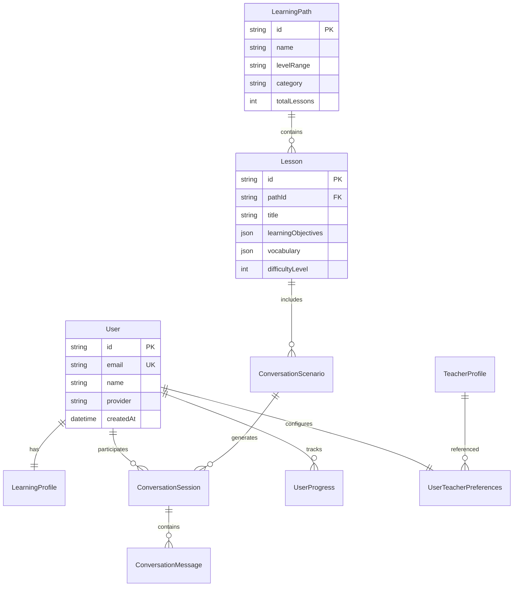

# Project Architecture

EnglishAI Master is a comprehensive English learning platform built as a modern full-stack application with real-time voice conversation capabilities, AI-powered tutoring, and personalized learning paths.

## 🏗️ System Overview

### Architecture Diagram
```
┌─────────────────┐    ┌─────────────────┐    ┌─────────────────┐
│   Frontend      │    │   Backend API   │    │   Database      │
│   (Next.js 14)  │◄──►│   (Express.js)  │◄──►│   (PostgreSQL)  │
│                 │    │                 │    │                 │
│  • React 18     │    │  • TypeScript   │    │  • Prisma ORM   │
│  • TypeScript   │    │  • Socket.IO    │    │  • Redis Cache  │
│  • Tailwind CSS │    │  • JWT Auth     │    │  • Migrations   │
│  • WebSockets   │    │  • OpenAI API   │    │                 │
└─────────────────┘    └─────────────────┘    └─────────────────┘
         │                       │                       │
         └───────────────────────┼───────────────────────┘
                                 │
                    ┌─────────────────┐
                    │  External APIs  │
                    │                 │
                    │  • OpenAI GPT-4 │
                    │  • OpenAI TTS   │
                    │  • OpenAI STT   │
                    │  • OAuth APIs   │
                    └─────────────────┘
```

## 🗂️ Monorepo Structure

The project is organized as a **Turborepo monorepo** with the following structure:

```
englishai-master/
├── apps/
│   ├── web/                    # Next.js 14 Frontend Application
│   │   ├── src/
│   │   │   ├── app/           # App Router pages
│   │   │   ├── components/    # React components
│   │   │   ├── hooks/         # Custom React hooks
│   │   │   ├── lib/           # Utilities and helpers
│   │   │   ├── stores/        # Zustand state management
│   │   │   └── styles/        # Global styles
│   │   ├── public/            # Static assets
│   │   └── package.json
│   └── api/                   # Express.js Backend API
│       ├── src/
│       │   ├── controllers/   # Route handlers
│       │   ├── services/      # Business logic
│       │   ├── middleware/    # Express middleware
│       │   ├── routes/        # API route definitions
│       │   ├── utils/         # Utility functions
│       │   └── types/         # TypeScript definitions
│       ├── prisma/            # Database schema & migrations
│       └── package.json
├── packages/
│   ├── types/                 # Shared TypeScript types
│   ├── config/                # Shared configuration
│   └── ui/                    # Shared UI components (future)
├── ssl/                       # SSL certificates for HTTPS
├── scripts/                   # Deployment and setup scripts
├── docker-compose.yml         # Development services
├── turbo.json                # Turborepo configuration
└── package.json              # Workspace root
```

## 🌐 Technology Stack

### Frontend Stack (apps/web)
| Technology | Version | Purpose |
|------------|---------|---------|
| **Next.js** | 14 | React framework with App Router |
| **React** | 18 | UI library |
| **TypeScript** | 5+ | Type safety |
| **Tailwind CSS** | 3+ | Utility-first CSS framework |
| **Headless UI** | 1+ | Accessible component primitives |
| **Zustand** | 4+ | Lightweight state management |
| **TanStack Query** | 4+ | Server state management |
| **NextAuth.js** | 4+ | Authentication solution |
| **Socket.IO Client** | 4+ | Real-time communication |
| **Framer Motion** | 10+ | Animation library |
| **Lucide React** | Latest | Icon library |
| **React Hot Toast** | 2+ | Notification system |

### Backend Stack (apps/api)
| Technology | Version | Purpose |
|------------|---------|---------|
| **Node.js** | 20+ | JavaScript runtime |
| **Express.js** | 4+ | Web application framework |
| **TypeScript** | 5+ | Type safety |
| **Prisma** | 5+ | Database ORM and toolkit |
| **PostgreSQL** | 15+ | Primary database |
| **Redis** | 7+ | Caching and session storage |
| **Socket.IO** | 4+ | Real-time communication |
| **JWT** | 9+ | JSON Web Token authentication |
| **bcryptjs** | 2+ | Password hashing |
| **Winston** | 3+ | Logging library |
| **Helmet** | 7+ | Security middleware |
| **CORS** | 2+ | Cross-origin request handling |

### External Services
| Service | Purpose |
|---------|---------|
| **OpenAI GPT-4** | AI conversation and text generation |
| **OpenAI Whisper** | Speech-to-text transcription |
| **OpenAI TTS** | Text-to-speech synthesis |
| **Google OAuth** | Social authentication |
| **Microsoft OAuth** | Social authentication |
| **AWS S3** | File storage (optional) |

## 🗄️ Database Architecture

### Database Design Principles
- **Relational Structure**: PostgreSQL with proper foreign key relationships
- **Normalization**: Optimized for data integrity and query performance
- **Indexing**: Strategic indexes for frequently queried fields
- **Migrations**: Versioned schema management with Prisma
- **Caching**: Redis layer for frequently accessed data

### Core Entities


### Key Relationships
1. **Users → Learning Profiles** (1:1): Personal learning preferences
2. **Users → Teacher Preferences** (1:1): AI teacher configuration
3. **Learning Paths → Lessons** (1:many): Curriculum structure
4. **Lessons → Conversation Scenarios** (1:many): Practice scenarios
5. **Users → Conversation Sessions** (1:many): Chat history
6. **Sessions → Messages** (1:many): Conversation content
7. **Users → Progress Records** (1:many): Learning analytics

## 🔄 Data Flow Architecture

### Authentication Flow
```
1. User Login Request → NextAuth.js → OAuth Provider
2. OAuth Response → JWT Generation → Token Storage
3. API Requests → JWT Validation → Protected Resources
4. Token Refresh → Automatic renewal → Continued Access
```

### Learning Session Flow
```
1. Path Selection → Lesson Loading → Teacher Assignment
2. Conversation Start → Context Loading → AI Initialization
3. User Input → Speech Recognition → Text Processing
4. AI Response → Text Generation → Speech Synthesis
5. Progress Update → Analytics Recording → State Persistence
```

### Real-time Voice Flow
```
1. Audio Capture → WebSocket Connection → Server Processing
2. Speech-to-Text → GPT-4 Processing → Response Generation
3. Text-to-Speech → Audio Streaming → Client Playback
4. Sentence Segmentation → Progressive Display → Synchronized Audio
```

## 🏛️ Service Architecture

### Backend Services Layer
```typescript
// Core service structure
services/
├── AuthService.ts          # Authentication & JWT management
├── OpenAIService.ts        # AI model integrations
├── VoiceService.ts         # Speech processing & TTS
├── TeacherProfileService.ts # AI teacher personalities
├── LearningService.ts      # Curriculum management
├── ConversationService.ts  # Chat session handling
├── AnalyticsService.ts     # Progress tracking
└── NotificationService.ts  # Email & push notifications
```

### Frontend State Management
```typescript
// Zustand store structure
stores/
├── authStore.ts            # User authentication state
├── teacherStore.ts         # Active teacher configuration
├── conversationStore.ts    # Chat session state
├── progressStore.ts        # Learning progress data
└── uiStore.ts             # UI state & preferences
```

## 🔌 API Architecture

### RESTful API Design
- **Base URL**: `/api/v1/`
- **Authentication**: Bearer JWT tokens
- **Content Type**: `application/json`
- **Status Codes**: Standard HTTP status codes
- **Error Format**: Consistent JSON error responses

### Endpoint Structure
```
/api/
├── auth/                   # Authentication endpoints
├── learning/               # Learning paths & lessons
├── conversations/          # Chat functionality
├── teacher-profiles/       # AI teacher management
├── voice/                  # Speech processing
├── analytics/              # Progress tracking
└── users/                  # User management
```

### WebSocket Integration
- **Namespace**: `/voice-conversation`
- **Authentication**: JWT token in query params
- **Events**: Typed event interfaces
- **Error Handling**: Graceful disconnection recovery

## 🛡️ Security Architecture

### Authentication Security
- **JWT Tokens**: RS256 algorithm with short expiry
- **Refresh Tokens**: Secure rotation mechanism
- **OAuth Integration**: Secure third-party authentication
- **Session Management**: Stateless JWT-based sessions

### API Security
- **Input Validation**: Express-validator and Zod schemas
- **Rate Limiting**: Request throttling per IP/user
- **CORS Protection**: Configured allowed origins
- **Security Headers**: Helmet.js implementation
- **SQL Injection**: Prisma ORM parameterized queries

### Data Protection
- **Password Encryption**: bcrypt with salt rounds
- **Sensitive Data**: Environment variable protection
- **Database Security**: Connection encryption
- **File Uploads**: Validation and sanitization

## 📊 Performance Architecture

### Frontend Optimization
- **Code Splitting**: Automatic route-based splitting
- **Image Optimization**: Next.js Image component
- **Bundle Analysis**: Webpack bundle analyzer
- **Caching**: Browser and CDN caching strategies
- **Lazy Loading**: Component and route lazy loading

### Backend Optimization
- **Database Indexing**: Strategic query optimization
- **Redis Caching**: Frequently accessed data caching
- **Connection Pooling**: Database connection management
- **Response Compression**: Gzip compression
- **Query Optimization**: Prisma query optimization

### Real-time Performance
- **WebSocket Optimization**: Connection pooling
- **Audio Streaming**: Chunk-based audio delivery
- **Voice Processing**: Parallel audio generation
- **Sentence Streaming**: Progressive response display

## 🔧 Development Architecture

### Build System
- **Turborepo**: Monorepo task orchestration
- **TypeScript**: Strict type checking
- **ESLint**: Code quality enforcement
- **Prettier**: Code formatting
- **Husky**: Git hooks for quality gates

### Testing Strategy
- **Unit Tests**: Jest for business logic
- **Integration Tests**: API endpoint testing
- **E2E Tests**: Playwright for user flows
- **Component Tests**: React Testing Library
- **Performance Tests**: Load testing with k6

### Deployment Pipeline
```
1. Code Push → GitHub Actions Trigger
2. Quality Gates → Tests, Lint, Type Check
3. Build Process → Docker Image Creation
4. Environment Deploy → Staging/Production
5. Health Checks → Smoke Tests
6. Rollback Ready → Blue/Green Deployment
```

## 🌍 Scalability Considerations

### Horizontal Scaling
- **Stateless API**: No server-side session storage
- **Database Scaling**: Read replicas and sharding
- **Caching Layer**: Distributed Redis cluster
- **Load Balancing**: Multiple API instances
- **CDN Integration**: Static asset distribution

### Vertical Scaling
- **Resource Optimization**: Memory and CPU efficiency
- **Database Optimization**: Query performance tuning
- **Connection Management**: Efficient connection pooling
- **Background Jobs**: Queue-based processing

This architecture provides a robust, scalable foundation for an AI-powered language learning platform with sophisticated voice interaction capabilities and modern development practices.